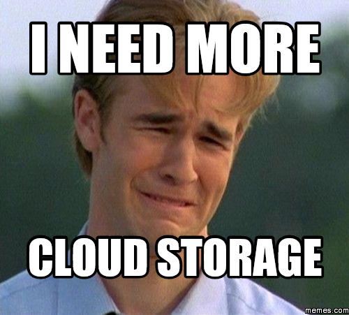

# RHMAP File Storage Service

Store and retrieve your files without hassle using mongodb gridfs storage engine.
Storage service was designed to run on RHMAP, but it can be easly adapted to run on docker and other servers with node.js and npm installed. 

##  Goal

- Provide abstraction for data storage
- Allow to store and retrieve any file using simple API
- Use mongodb and gridfs as storage solution

## Technologies used:

- node 4.4.x
- express
- mongose 

See package.json for more information

## RHMAP Setup
There are currently some workarounds needed to get the service up and running within RHMAP the platform. 

1. Make the newly created service public
2. Visit the data browser, depending on your application configuration a "Upgrade Database" action will be available, this means the application is using an old/legacy shared database and it needs to be upgraded to use a dedicated one. Note the application needs to be first finished its initial deploy and be running to perform this task.
3. Re-deploy the service
4. You can now use the service under the "Preview" section of the studio. 

## Local and development setup

Install dependencies
    
    npm install

Execute grunt 

    grunt serve 

## Web interface


## API

### Upload files 
> POST /api/files/

Upload file using multipart form-data body.

#### Form body:
    
> file 

Represents binary file that would be uploaded.
Example html form element:  

`<input type="file" name="file"/>`
    
> redirectOnSuccess

If added instead of returning json results backend would redirect to path provided as value.
Example html form element: 

    `<input type="hidden" name="redirectOnSuccess" value="/"/>`
    

Example body containing both parameters:
```
------WebKitFormBoundaryKKdzzkCch9eo2hG0
Content-Disposition: form-data; name="file"; filename="yourfile.txt"
Content-Type: text/plain

------WebKitFormBoundaryKKdzzkCch9eo2hG0
Content-Disposition: form-data; name="redirectOnSuccess"
/
```

### Retrieve files 
> GET /api/files/:filename

Stream uploaded file. Returns file octet stream 

### Delete file from database

> DELETE /api/files/:filename

Delete uploaded file by `filename`. Object id can be also specified as filename.

## Why using mongodb as storage solution

- When using mongo data and files are stored in one place
- Ability to replicate files using mongo mechanisms
- Seamless way to backup data using existing mongo backup solutions
- Possibility to stream data
- Easy to monitor storage and provide alerts
- Possible to manage and query file metadata without effort



## Contributing

See CONTRIBUTING.md 
